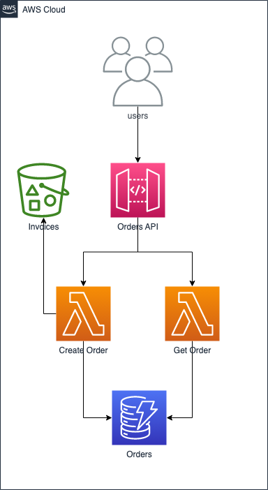

# serverless basic salad stack

#### This is a basic example of a SALAD stack, which uses S3, API Gateway, Lambda and DynamoDB; as a guide to spinning up a very quick serverless app.



Run the following steps to create a basic cdk/typescript SALAD stack app:

1. Create an 'app' folder in the base of the repo.
2. In the app folder, in the terminal run

`cdk init app --language typescript`

3. Install the following deps:

`npm i -D esbuild`

`npm i -D @types/aws-lambda @types/uuid`

`npm i aws-sdk uuid`

4. Add the relevant scripts to the package.json file:

```
"scripts": {
    "deploy": "cdk deploy --outputs-file ./cdk-outputs.json --all",
    "remove": "cdk destroy --all"
  },
```

5. Add the relevant imports to the top of the `app-stack.ts` file:

```
import * as apigw from 'aws-cdk-lib/aws-apigateway';
import * as cdk from 'aws-cdk-lib';
import * as dynamodb from 'aws-cdk-lib/aws-dynamodb';
import * as lambda from 'aws-cdk-lib/aws-lambda';
import * as nodeLambda from 'aws-cdk-lib/aws-lambda-nodejs';
import * as path from 'path';
import { RemovalPolicy } from 'aws-cdk-lib';
import * as s3 from 'aws-cdk-lib/aws-s3';
```

6. Add the S3 bucket:

```
const saladBucket: s3.Bucket = new s3.Bucket(this, 'SaladBucket', {
  bucketName: 'salad-app-example-bucket',
});
```

7. Add the dynamodb table:

```
// create the dynamodb table
const saladAppTable: dynamodb.Table = new dynamodb.Table(
    this,
    'SaladAppDB',
    {
    billingMode: dynamodb.BillingMode.PAY_PER_REQUEST,
    tableName: 'salad-app-db',
    encryption: dynamodb.TableEncryption.AWS_MANAGED,
    pointInTimeRecovery: false,
    contributorInsightsEnabled: true,
    removalPolicy: RemovalPolicy.DESTROY,
    partitionKey: {
        name: 'id',
        type: dynamodb.AttributeType.STRING,
    },
    }
);
```

8. Add the basic rest api

```
// create the rest api
const ordersApi: apigw.RestApi = new apigw.RestApi(this, 'SaladAppApi', {
    description: 'Salad App API',
    deploy: true,
    deployOptions: {
    stageName: 'prod',
    loggingLevel: apigw.MethodLoggingLevel.INFO,
    },
});

// create the rest api resources
const orders: apigw.Resource = ordersApi.root.addResource('orders');
const order: apigw.Resource = orders.addResource('{id}');
```

9. Create the lambda functions:

```
const createOrderLambda: nodeLambda.NodejsFunction =
      new nodeLambda.NodejsFunction(this, 'CreateOrderLambda', {
        runtime: lambda.Runtime.NODEJS_16_X,
        entry: path.join(
          __dirname,
          'src/handlers/create-order/create-order.ts'
        ),
        memorySize: 1024,
        handler: 'handler',
        bundling: {
          minify: true,
          externalModules: ['aws-sdk'],
        },
        environment: {
          TABLE_NAME: saladAppTable.tableName,
          BUCKET_NAME: saladBucket.bucketName,
        },
      });

    const getOrderLambda: nodeLambda.NodejsFunction =
      new nodeLambda.NodejsFunction(this, 'GetOrderLambda', {
        runtime: lambda.Runtime.NODEJS_16_X,
        entry: path.join(__dirname, 'src/handlers/get-order/get-order.ts'),
        memorySize: 1024,
        handler: 'handler',
        bundling: {
          minify: true,
          externalModules: ['aws-sdk'],
        },
        environment: {
          TABLE_NAME: saladAppTable.tableName,
        },
      });
```

10. Hook up the lambdas to the api:

```
// hook up the lambda functions to the api
orders.addMethod(
    'POST',
    new apigw.LambdaIntegration(createOrderLambda, {
    proxy: true,
    })
);

order.addMethod(
    'GET',
    new apigw.LambdaIntegration(getOrderLambda, {
    proxy: true,
    })
);
```

11. Give the lambda functions access to the dynamodb table and s3:

```
saladAppTable.grantReadData(getOrderLambda);
saladAppTable.grantWriteData(createOrderLambda);

// grant the create order lambda access to the s3 bucket
saladBucket.grantWrite(createOrderLambda);
```

12. Create the following files:

```
../lib/src/handlers/create-order/create-order.ts
../lib/src/handlers/get-order/get-order.ts
```

13. Copy paste the relevant handler code into the two files above from this repo.

14. You can test the api using the postman file found in ./postman/
